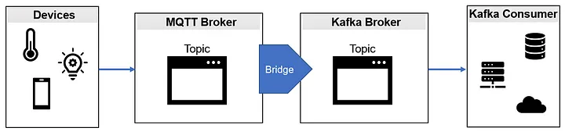
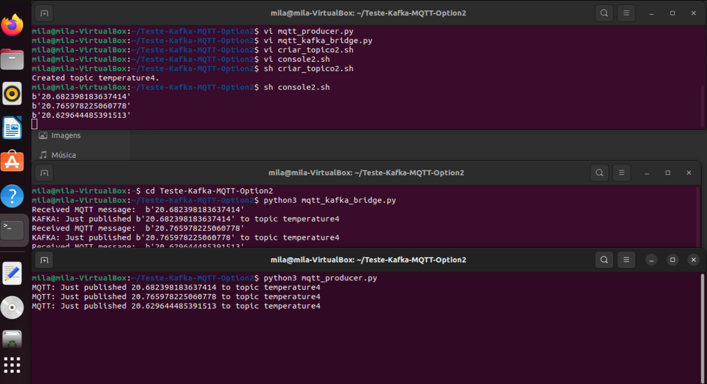

# Teste-Kafka-MQTT-Option2
Teste de comunicação de um Dispositivo IoT  enviando  mensagem  para o broker MQTT, que através de uma ponte envia a mensagem para o broker KAFKA (Opção 2).

Baseado nas instruções de https://medium.com/python-point/mqtt-and-kafka-8e470eff606b.

    

## Print da tela com o projeto rodando:

    

